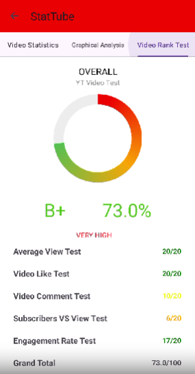
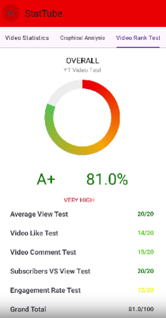

# [StatsTube](https://github.com/StatsTube)  

StatsTube is a YouTube analytics app built with **JAVA** that helps creators and viewers understand channel performance and video statistics in detail.  

With StatsTube, users can explore metrics, compare channels, and gain insights into growth trends and engagement.  

  
  

## 📱 Demo

  
  
  
  
  

