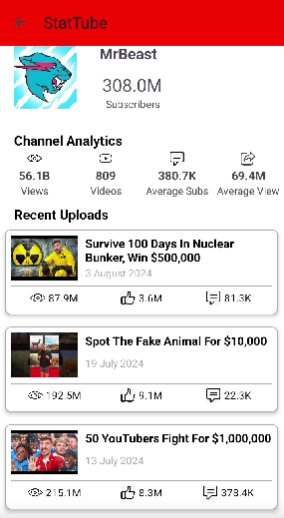
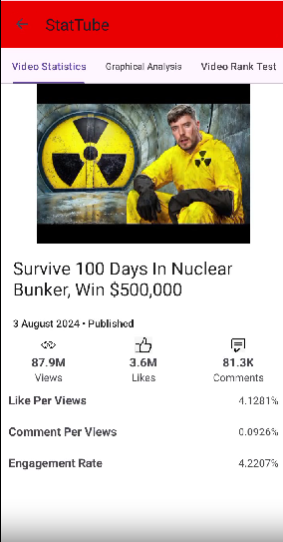

# [StatsTube](https://github.com/StatsTube)  

StatsTube is a YouTube analytics app built with **JAVA** that helps creators and viewers understand channel performance and video statistics in detail.  

With StatsTube, users can explore metrics, compare channels, and gain insights into growth trends and engagement.  
Material Dashboard makes use of light, surface and movement. The general layout resembles sheets of paper following multiple different layers, so that the depth and order is obvious. The navigation stays mainly on the left sidebar and the content is on the right inside the main panel.

  
  

## 📱 Demo

  
  
  
  
  
  

